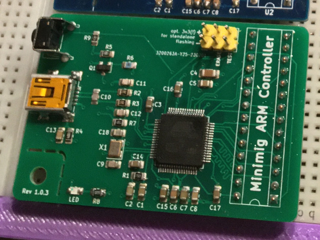

# Minimig-ARM-Controller-0805

Rebuild Minimig ARM Controller board using 0805 SMD components.

> ⚠️ IMPORTANT NOTICE! It seems that only the first rev 1 of my Minimig controller is working! See issue #1

## Preface

Thanks to [Dennis van Weeren](https://en.wikipedia.org/wiki/Minimig), Jakub Bednarski and all contributors for the great [Minimig](https://en.wikipedia.org/wiki/Minimig) project! 
_"Never give up, never surrender!"_ **;o)**

## Disclaimer

> Use/build this project/pcb at your own risk. I am a hobbyist and not an professional 
> electrician or pcb designer and not responsive for any damage to your Minimig.
> 
> By the way my version is not as smart and elegant like the original, i am just using 
> 4 layers instead of two ;o)

## Introduction

Me as a late starter to the Minimig project late 2020 wants to build a [Minimig](https://en.wikipedia.org/wiki/Minimig) to get again the Amiga feeling i 
had a couple of years ago where i owned the most models of the [Amiga](https://en.wikipedia.org/wiki/Amiga) family.

First i tried to solder the [ARM controller board](https://www.amigawiki.org/doku.php?id=de:expansion:storage:minimig_arm_controller) needed for the [Minimig](https://en.wikipedia.org/wiki/Minimig). I ment i was good in soldering but screwed up ;o)
Because of this defeat i decided to make a board using 0805 SMD components for easy hand soldering. And my eyes are also not the very best at all ;-)

## What is included in this repository?

* KiCad files
* Gerber files
* [Firmware files](/firmware/Readme.md)

## BOM

This rebuild pcb uses the same designators as the existing ARM controller.
To buy the parts for this board you can use the existing [a1k.org parts list](resources/minimig_arm_v11fix_bestueckung.pdf).
But instead of 0603 components you can use the larger 0805 smd components.

## How to flash the ARM Controller firmware

The needed firmware [you can find here](https://www.a1k.org/forum/index.php?threads/39601/) (requires registration) or in [this repository](/firmware/Readme.md).

### Flash standalone

1. Connect the TEST header pins with a jumper. Then power up the board with 3.3 V connected to the 
   DC pins (double check correct orientation!) for round about 7 - 10 seconds (see picture below). Shutdown the power again. 
   Remove the jumper from TEST header pins. The Atmel AT91SAM7S256 MCU should be now in usb programming mode.

2. Now connect the ARM controller with the USB cable to your pc. And power up the board again.

3. For example under Ubuntu you should see now a usb device **/dev/ttyACM0**. For 
   Ubuntu you need the [SAM-BA CDC 2.18](https://www.microchip.com/en-us/development-tool/SAM-BA-In-system-Programmer) ([Download](https://ww1.microchip.com/downloads/en/DeviceDoc/SAM-BA+v2.18+for+Linux.zip)) utility (maybe a newer version is working too).

4. When connected choose the bin firmware file and press "Send File".

5. In next dialoges for unlock/lock regions you can press "Ja"/"Yes" two times.

6. At the end you can verify if the flashing process where 
   successfully on pressing "Compare sent file with memory"

### Flash connected to Minimig

Should work in the same way as described above with the difference that the 
board is connected to the Minimig and get its power from there.

## Mounted ARM controller

## Running Minimig v1.1 with my version

## PCB Layers

Layer Nr | Comment
--- | ---
1 | Signal
2 | +1V8 plane VDDCORE
3 | +3V3 plane VDDIN
4 | GND plane/Signal

## Comparison between versions

0805 rev1.0.3 | 0805 rev1.0.2 | 0805 rev1 | original 0603 version
--- | --- | --- | ---
 |  |                | 
no stable | not stable | stable(?) |
changes: reset button, power led, smd resonator | changes: dont know anymore ;o) |  | What a beauty of a pcb design of Jakub!
 |  |  | 
 |  |  | 

## Resources and links

* [Original Minimig page](https://www.techtravels.org/wp-content/uploads/pefiles/minimig/weeren001/minimig.html)
* [Minimig on a1k.org](https://www.a1k.org/forum/index.php?forums/53/)
* [Minimig on amigawiki.org](https://www.amigawiki.org/doku.php?id=de:models:minimig)
* [Minimig on Wikipedia](https://en.wikipedia.org/wiki/Minimig)
* [Minimig on Illuwatar Design](http://www.illuwatar.se/)
* [Make: Poor man's Minimig ARM Controller](https://sweetlilmre.blogspot.com/2013/05/make-poor-mans-minimig-arm-controller.html)
* [An FPPGA based Amiga – The Minimig](https://theretrohacker.com/2022/12/20/an-fppga-based-amiga-the-minimig/)
* [cristianoag/minimig](https://github.com/cristianoag/minimig)
* [wiretap-retro/MigStorm-ITX](https://github.com/wiretap-retro/MigStorm-ITX)
* [minimig.ca](https://www.minimig.ca/index.php/software/)
